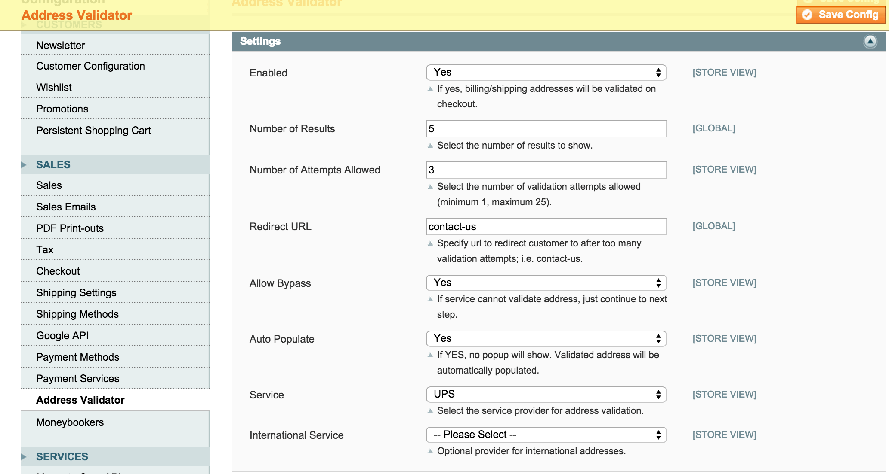
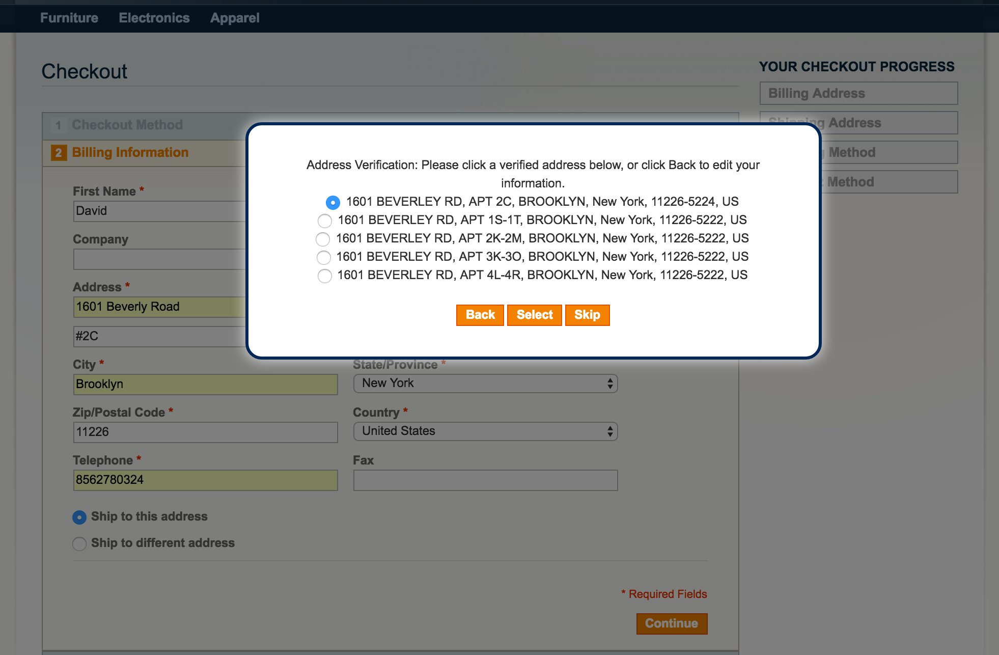

Address Validator
=================
Validate billing and shipping addresses in the Magento One Page Checkout. 

Description
-----------
Validate billing and shipping addresses in the Magento One Page Checkout. 
Customer submits billing and shipping addresses and is shown a popup of valid 
addresses to choose from. Currently has support for Fedex, USPS and UPS.

Install
-------
Modman:

<pre>
modman clone https://github.com/ExtensionsStore/Addressvalidator
</pre>

Composer:

<pre>
{
    "require": {
        "magento-hackathon/magento-composer-installer": "dev-master",
    	"extensions-store/addressvalidator" : "1.5.2"
    },
    "repositories" : [
    	{
    		"type" : "vcs",
    		"url" : "https://github.com/ExtensionsStore/Addressvalidator"
    	}  	
    ],
    "extra": {
        "magento-root-dir": "./html",
        "magento-deploystrategy": "copy",
        "magento-force" : true,
        "with-bootstrap-patch" : false
    }
}

</pre>

Upload the files to the root of your Magento install. Let the install script 
run. This will create the table extensions_store_addressvalidator_responses to hold 
requests and responses. In the admin System -> Configuration, go to Sales -> Address 
Validator and configure the extension with your validation provider 
(UPS, USPS, Fedex) account. Clear cache. 

For Fedex and USPS, configure the credentials in the Shipping Methods. 
See the <a href"https://github.com/ExtensionsStore/Addressvalidator/wiki">Wiki</a> 
for more information.

Here's a screenshot of the popup:

Documentation
-------------
See the Wiki at <a href"https://github.com/ExtensionsStore/Addressvalidator/wiki">https://github.com/ExtensionsStore/Addressvalidator/wiki</a>.

Support
-------
As this is a free extension, no support or guarantee is implied or provided. 
However, I can be contacted at https://www.extensions-store.com/support.html. 
Paid support including installation, configuration and custom development is 
available. Also, further development and updates are dependent on client support.
