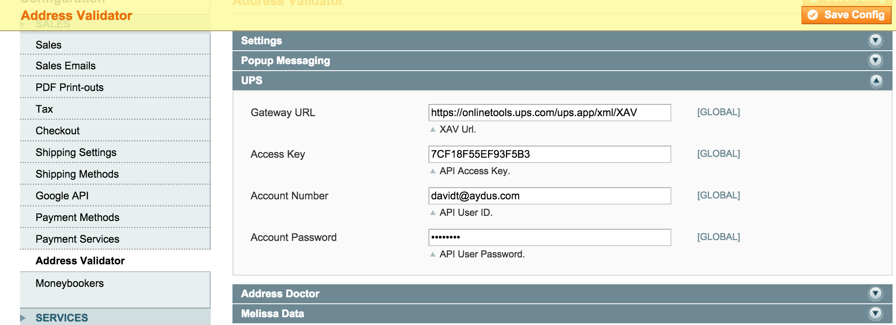

Address Validator
=================
Validate billing and shipping addresses in the One Page Checkout. 

Description
-----------
Validate billing and shipping addresses in the One Page Checkout. 
Customer submits billing and shipping addresses and is shown a popup of valid 
addresses to choose from. Currently has support for Fedex, USPS, UPS, Address 
Doctor and Melissa Data.

How to use
-------------------------
Upload the files to the root of your Magento install. Let the install script 
run. This will create the table extensions_store_addressvalidator_responses to hold 
requests and responses. In the System -> Configuration, go to Sales -> Address 
Validator and configure the extension with your validation provider 
(UPS, USPS, Fedex, Address Doctor, Melissa Data, etc.) account. Clear cache. 

Here's a screenshot of the popup:

UPS
---
For UPS, enter your access key, account number and password. Credentials can be
obtained from the UPS
<a href="http://www.ups.com/content/us/en/resources/techsupport/developercenter.html">
Developer Resource Center.</a> 

Per the UPS Developer terms of service, the UPS logo must be visible on your 
site. Logo images can be found under  
skin/frontend/base/default/images/extensions_store/addressvalidator/LOGO_L.gif. 
